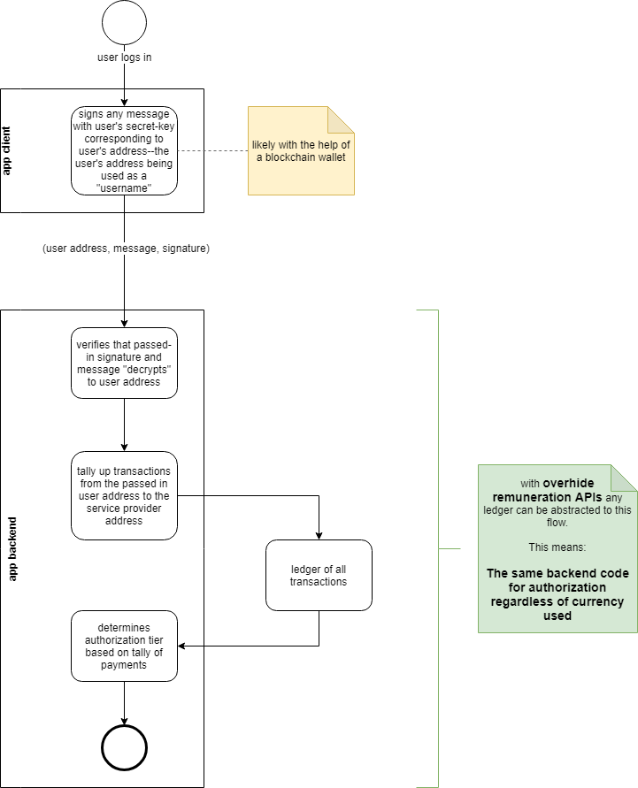
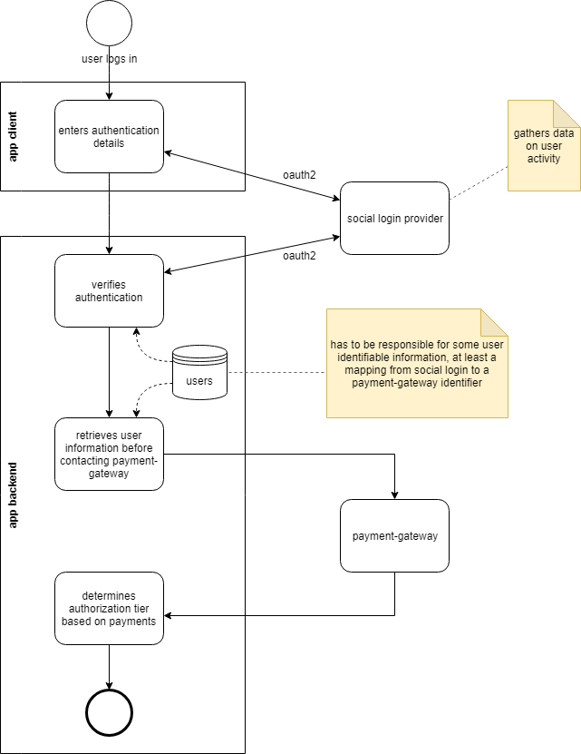
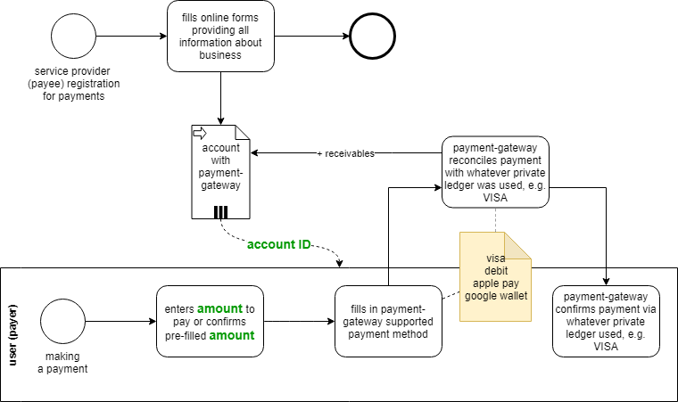
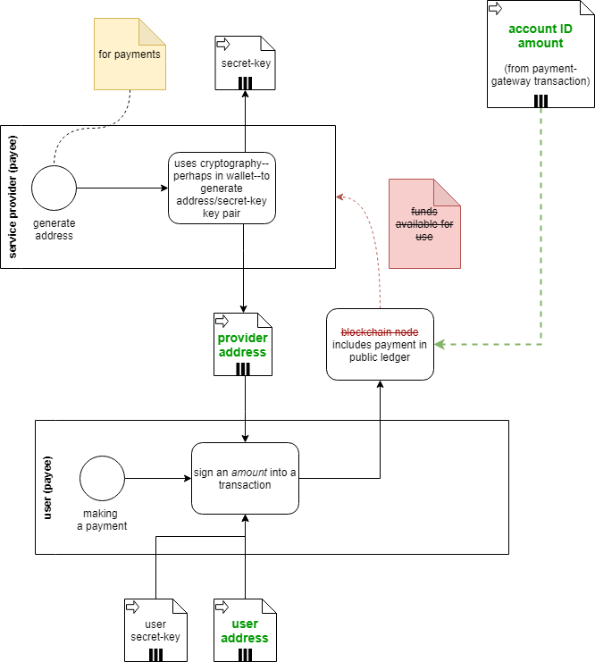

# Introduction to [*overhide-ledger*](https://ohledger.com) and Motivation for Why it's Useful.

I'd like to introduce [*overhide-ledger*](https://ohledger.com): a centralized Web 2.0 ledger of dollar transactions exposed through a minimal API.

The intent of the ledger is to enable a simple authorization workflow that's useful today for dollars and tomorrow for cryptos.

The [*overhide-ledger*](https://ohledger.com) interface and APIs allow payees and payers to log their credit card transactions on a publicly visible ledger.  The payees and payers appear on the ledger as Ethereum addresses: 42 character hexadecimal strings.  These obscure identifiers are conjoined with dollar amounts and timestamps to complete respective entries.

## Workflows

The question of why such a ledger is useful needs to be considered in the context of workflows it's improving.  We will see that [*overhide-ledger*](https://ohledger.com) improves software authorization workflows involving fiat money to match significant value-adds of authorization workflows possible with public key infrastructure from decentralized ledgers such as Ethereum and Bitcoin.

Before we get into discussing this "ledger-based authorization workflow" and contrast it with current Web 2.0 approaches; we need to understand some concepts from the decentralized Web.  For this discussion we need to understand the simple concepts of a ledger and it's respective public key infrastructure.  

### Some Basics from Crypto Ledgers

For our purposes a ledger is as simple as a table with payers, payees, amounts, and timestamps.

| payer | payee | amount | timestamp |
| --- | --- | --- | --- |
| Fred | Acme Co. | $10 | Yesterday |
| Mick | Glopex Inc. | $2 | 2 hours ago |

For the needs of ledger-based authorization we'll replace all the names with public addresses that those parties "own".  We use Ethereum addresses.

| payer | payee | amount | timestamp |
| --- | --- | --- | --- |
| 0xD32317b5651d9f9D636032aaD100D9d30F74481d | 0x41340dF846177A02D5a16995E2Faf4917251d0dc | $10 | Yesterday |
| 0xF00450C4cC9b46E837fb4feffE9e4FEdAAb94347 | 0xF60c97206C2DA2cad37B6Fd0B29BA33e043E2897 | $2 | 2 hours ago |

Fred from the first ledger is replaced in the second ledger by his pseudonymous Ehtereum address, the 42 character hexadecimal string: 0xD32317b5651d9f9D636032aaD100D9d30F74481d.  This is Fred's public address in the ledger.  It is an Ethereum compliant address, but the fact that it's generated with Ethereum libraries is immaterial.  It's not limited to the Ethereum blockchain, we can use this address in other ledgers following Ethereum public key conventions--and we do, [*overhide-ledger*](https://ohledger.com) uses Ethereum public key infrastructure.

Fred can proove he owns that address by having its corresponding secret key: e398cc1f41b6e00c88b7c625b81858aa89f6e1dea753203186ffa4c886497ee9.  This is a 60 character hexadecimal string that is cryptographically tied to Fred's address.  Fred never discloses this secret key.  Fred only uses this secret key to prove he owns his address and therefore that it is him who made the $10 payment to whomever is 0x41340dF846177A02D5a16995E2Faf4917251d0dc (we know it's Acme Co.).  To make this proof, Fred would use cryptography to "sign" some message--for example today's date--into a "signature" with his secret key.  Through cleverness of cryptography, anyone with whom Fred shares his address, this signature, and the original message--today's date--can verify the signature's validity for the address; hence Fred's posession of the secret key, hence Fred's ownership of the ledger address.

> The significant takeaway regarding Ethereum public-key infrastructure--or that of any public blockchain ledger--is that public addresses have corresponding private secret keys for signing some message into signatures; that equate possession of the secret key to ownership of the address.

### Ledger Based Authorization

Above we introduced that ledgers and public-key infrastructure together support a certain authorization workflow.  In truth the public-key infrastructure is the authentication portion and is nicely decoupled from authorization, which requires a ledger.  This authentication is rooted solely in cryptographic algorithms and doesn't require a ledger--just appropriate software libraries.

Authorization very much requires a ledger as authorization dictates access level tiers based on monies paid.

Without any further preamble, below is our preferred workflow.

*Figure 1: Ledger-based authorization workflow.*

The workflow starts at the top in the *login client* where a user logs in with their ledger address.  This is where authentication happens without any need to actually contact the ledger.  Usually this authentication happens with the help of an in-browser wallet:  the wallet helps furnish signatures for the address.

Although it's not strictly necessary to contact the ledger at this point, it's worthwhile if the user needs to transact with the ledger to make payments.  Later down in the flow we'll check for monies paid to authorize access tiers.  There is no opportunity to pay money later on in the flow.  Usually transacting with the ledger is done through a wallet that is only available at this layer, in the browser, in the login client.

Exiting the *login client* we pass the user's *address*, a signed *message*, and *signature*, to the *service* proper.  The service prudently verifies the address against the signature and message.  To prevent replay attacks it'd be additionally prudent for the *service* to issue the *message* in the first place--to be signed and returned--but we don't show such enhancements for simplicity.

Subsequently the service authorizes the passed in *address* for some access tier.  It contacts the ledger to retrieve a tally of transactions from the *address* to the service provider.  The tally can take many forms; perhaps it's all payments in the last week.  We could have different fee schedules for different tiers.  It's simple and flexible.

There are several benefits to this flow.

The service doesn't need to know anything about the user or store any credentials, payment details, personal information.

There is a reduction of coupling between the a service and its login client.  

It can be reasoned about simply at a high level: if you have an address on ledger, you can authenticate; if you have money paid on the ledger, you can authorize for higher access tiers.

But the main benefit is suggested with the green blurb on the right of the diagram: the mention of how *overhide* remuneration APIs can abstract any ledger to enable this authorization flow.  The significance here: a single implementation in code can leverage any currency.  Any cryptocurrency--and with [*overhide-ledger*](https://ohledger.com)--dollars.  

And regarding fiat currencies? The *overhide* remuneration API is covered in detail in a section below.  We'll get to that after we have a brief look at a typical Web 2.0 fiat authorization workflow, to contrast with what we just saw.

### Typical Web 2.0 Authorization

To contrast the preferred authorization flow in the previous section, we model a typical Web 2.0 auth flow below.

*Figure 2: Web 2.0 authorization flow*

We again start at the top.  This time the login client uses some form of social login:  Twitter, Facebook, LinkedIn, Google.

The social login provider vets your authentication credentials on behalf of the service you're trying to use.  This third party coupling means the social login provider gets to learn a lot about the users logging in.

But the social login provider doesn't deal with authorizations.  If the service is to support authorization tiers based on monies received, it necessarily needs to hold and be privy to personal information of its users.  

The service provider has to get into the business of collecting information about its users if it desires remuneration.  This, whether it needs the information for the service's value-add or not.

We do recognize that this collection of information is in-fact desirable to many service providers.  We operate in a milieu where hoarding information about users is a boon.  But increasingly, month to month, it's a burden.  The software developer has to decide where they want to derive value and how much responsibility they want to shoulder.

## Remuneration APIs

As seen in a previous section the ledger-based authorization flow is attractive and we would like to use the same libraries and the same code flow for multiple currencies.  The green blurb in figure 1 indicated that this is where the *overhide* remuneration API shines.

The model below shows where the *overhide* remuneration API sits in reference to ledgers, wallets used by login, and the service code.

*Figure 3: Currencies abstracted by overhide remuneration API*

As the note on the *service code* suggests, only availability of HTTP is necessary to provide our preferred authorization flow for the service. 

Each ledger--Bitcoin, Ethereum, or [*overhide-ledger*](https://ohledger.com) for dollars--expose their own identical API: they have a proxy implementing the same identical interface.  The login page need merely indicate the user's address from one of the supported ledgers and the corresponding API URL.  The service code need necessarily lookup a different fees schedule for each currency supported, but other than that, these are the only variables in an otherwise common flow.

There are only two methods in this API:

* get transactions / tallies
* verify identity

The APIs for Ethereum are made available by the [*overhide-ethereum* remuneration provider](https://ethereum.overhide.io/swagger.html). 

The APIs for dollars are made available by the [*overhide-ledger* remuneration provider](https://ohledger.com/swagger.html).

Bitcoin, tether, EOS, and others are yet to be implemented, hopefully more with community help: these APIs can be implemented for any cryptocurrency.

Similarly, [*overhide-ledger*](https://ohledger.com) could be stood up for other fiat currencies other than dollars.

Making this API abstraction available for fiat currencies and enabling ledger-based authorization with either type of currency is the whole purpose of [*overhide-ledger*](https://ohledger.com).

>
> Making this API abstraction available for fiat currencies and enabling ledger-based authorization with either type of currency is the whole purpose of [*overhide-ledger*](https://ohledger.com).
>

### From Login client to Service Business End

With reference to figure 3 above, note that:

* the login page is decoupled from the business logic service
* login page interacts with ledgers to view transactions and create payments on the ledger
* payments to ledgers are through wallets
* authentication occurs at the login phase without necessarily using any ledger, by simply signing a public address
* this layer is likely in the browser while the business end is in native code or some back-end
  * consider that even video games--beautifully rendered with 3D engines--often use the browser for account management
  * you're not hurting yourself creating ledger transactions using a browser in the near future; as it supports a plethora of wallets
* the service can be on any software stack as long as supports HTTP calls
* authentication and authorization don't need a browser: simple HTTP API can be called from any software stack
* authentication and authorization can be abstracted for most ledgers; keeping the core app code the same despite ledger in use

### [Demo](https://github.com/overhide/ledgers.js)

Before diving any deeper into describing [*overhide-ledger*](https://ohledger.com), the concepts just described may become more tangible through a [demo](https://github.com/overhide/ledgers.js) meant to help developers see the approach in a "real" application.

We have a functioning [demo "game"](https://github.com/overhide/ledgers.js) with a sample login page.  The login page allows either a free account login or value-add pay-for tiers.  Payments in this game can be made using either ether or dollars.

Go check the demo out at [https://github.com/overhide/ledgers.js](https://github.com/overhide/ledgers.js).

## [*overhide-ledger*](https://ohledger.com)

We've motivated the ledger-based authorization flow and mentioned that [*overhide-ledger*](https://ohledger.com) enables it for dollars.

*Figure 4: Overhide-ledger for fiat dollar transactions*

The ledger sits in the cloud as indicated by the bold arrows.  

The [ledgers.js library](https://www.npmjs.com/package/ledgers.js) sits in the browser.  It is used by your browser's JavaScript in the same abstracted fashion regardless of remuneration provider.  The linked [demo](https://github.com/overhide/ledgers.js) shows this in action.

[ledgers.js](https://www.npmjs.com/package/ledgers.js) and [*overhide-ledger*](https://ohledger.com) comprise a tool-set to aid developers in leveraging ledgers for authorization; while providing a "lubricant" to app users' transition from paying for services in dollars to paying in cryptos:  showcasing the benefits of cryptos such as pseudonimity and lower transaction cost.

By using [ledgers.js](https://www.npmjs.com/package/ledgers.js) and [*overhide-ledger*](https://ohledger.com); developers future-proof their code.

### What Does [*overhide-ledger*](https://ohledger.com) Do?

We have covered enough about the why, let's get into the how--how [*overhide-ledger*](https://ohledger.com) creates its ledger.

To understand what [*overhide-ledger*](https://ohledger.com) does let's compare how transactions are added using a dollar payment-gateway versus a decentralized ledger like Ethereum.  The [*overhide-ledger*](https://ohledger.com) approach borrows from both.

*Figure 5: Payment-gateway transaction in dollars*

Figure 5 shows two related flows.  The top flow is a service provider registering to receive payments.  Since we're dealing with a payment-gateway such as PayPal or Stripe, the service provider goes through several layers of forms and verification.  At the end of this process the service provider has an account with the payment-gateway that can receive funds using any number of methods such as credit cards.

The bottom flow in figure 5 is a user making a payment.  The payment process uses the service provider's *account ID* to receive a requested *amount*.  The payment-gateway is a black-box taking care of a lot of the heavy lifting with card issuers and banks.  After a little data entry on the user's side, the service provider receives their fee and the user gets a confirmation.

All the steps in figure 5 are abstracted by [*overhide-ledger*](https://ohledger.com) and furnished by [*ledgers.js*](https://www.npmjs.com/package/ledgers.js) so that the developer doesn't need to implement them.  The [*overhide-ledger*](https://ohledger.com) necessarily handles these bits as it needs to inject itself into the process so as to capture the values in green:

* *account ID* 
* *amount* 

The values in green--*account ID* and *amount*--are retrieved from the payment-gateway workflow and used with additional cryptographic bits from a blockchain-like transaction workflow to comprise a complete [*overhide-ledger*](https://ohledger.com) entry.

*Figure 6: Transaction in on a decentralized ledger like Etehreum*

Before we get to deep into this workflow, consider that the *account ID* and *amount* from figure 5 are shown being injected from the upper right corner.

The top flow in figure 6 is once again part of service provider registration.  When using the [*overhide-ledger*](https://ohledger.com) this top flow and the top flow in figure 5 are done behind the scenes at the same time.  Here the flow furnishes a *provider address* from either an Ethereum wallet or freshly minted from an Ethereum library.  

The bottom flow is a user transacting on the ledger.  The last green attribute results from this flow, the *user address*.  

Consider for a moment that figure 6 actually represents a decentralized blockchain transaction.  If you ignore the injection of *account ID* and *amount* from the top right, and consider the crossed out bits in red, you actually have a model of a transaction being signed and sent to an Ethereum node.

But since this isn't a blockchain transaction, it's an [*overhide-ledger*](https://ohledger.com) transaction, it's not a blockchain-node that processes a transaction from the user to the service provider, making funds available as unspent transaction outputs or ledger account balances. Instead it's a centralized [*overhide-ledger*](https://ohledger.com) that uses most of the same process until it's time to write to the ledger. At that time, it only uses the addresses and the signing from the flows in figure 6.  The ledger doesn't have decentralized nodes, leave those bits crossed out in red.  The four attributes in green from figures 5 and 6, in addition to a timestamp, constitute a complete ledger entry:

* *provider address* 
* *user address* 
* *amount* 
* *timestamp* 

The *account ID* is not part of the entry.  There is a separate mapping from *provider address* to corresponding *account ID*. 

The ledger itself doesn't store user identifying information; it does store a hash of the user's email.

The ledger does necessarily store the payment-gateway *account ID* of the service provider.

There is no anonymity or decentralization here, but we've enabled ledger-based authorization with dollars.

> Please be aware that the [*overhide-ledger*](https://ohledger.com) functionality discussed above in this section is closed source and has a pending US PTO application (No. 62817820) "PSEUDONYMOUS FIAT CURRENCY TRANSACTION LOGGER SYSTEM AND METHOD FOR PAYMENT GATEWAYS".

### Differences From Blockchain

For completeness let's enumerate some obvious differences between [*overhide-ledger*](https://ohledger.com) and blockchain ledgers.

First, there is no pseudonimity between the payee and the payer: they know more details about each-other.  The [*overhide-ledger*](https://ohledger.com) doesn't get involved with those personal details, they are relegated to the payment-gateway.  But the two entities do interact.

Although pseudonimity is reduced for the parties involved in a transaction; the public at large still just sees a ledger with hashes.

It might have been more appealing to have [*overhide-ledger*](https://ohledger.com) be an abstraction between the payee and the payer, have each deal solely with [*overhide-ledger*](https://ohledger.com) segregated from each-other.  Although with that approach the ledger would know more about the entities, the entities would be more pseudonymous to each-other.  Unfortunately--since we're not dealing with cryptos where a transaction is the final word--this would open the ledger to risks of chargebacks, returns, and other problems. 

Further, because of the possibility of chargebacks and refunds, the service provider necessarily needs the ability to mark transactions "marked as void by provider":  flagging a transaction on the ledger as no longer valid.  The transaction is not removed from the history, but it is flagged as void.

While we're at it--since we already removed quite a few value-adds of blockchains to make the ledger compatible with the world of fiat money transfers; we might as well provide a pseudo password-reset.  Since the [*overhide-ledger*](https://ohledger.com) hashes email addresses of users, it can--provided said email from said user--allow a user to rewrite a transaction to appear from a new cryptographic key-pair.  A password-reset if you will.

So in the end who knows what in [*overhide-ledger*](https://ohledger.com)?

* Stripe knows both parties intimately
* [*overhide-ledger*](https://ohledger.com) knows *of* both parties
* payer can proove ownership of her public address
* payee can proove ownership of her private address
* everyone knows the pseudonymous payment was made for all time

## Community needed

At this point we have an open sourced implementation of the *overhide* remuneration API for Ethereum, we also have the API itself.

The [*overhide-ledger*](https://ohledger.com) is closed-source, but the [*ledgers.js*](https://www.npmjs.com/package/ledgers.js) library tying it all together for developers is open.

We'd want the ecosystem to grow and for that we need to implement more remuneration providers: more implementations of the *overhide* remuneration API.

Lastly, it's worth mentioning that all of this was written because it's needed for remuneration in another product we specced out to write together with the open source community:  [overhide.io](https://overhide.io).

The release to open source is imminent, we just need to finsih a minimally-viable product to make the concepts more concrete.
